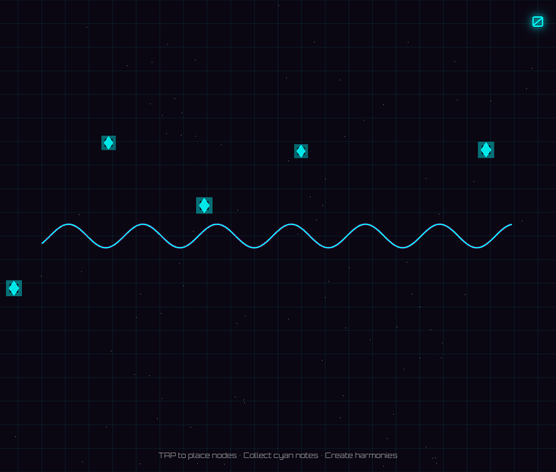

# Frequency Shift

*In the year 2847, the Harmonic Engine—a device that could translate emotion into music—went silent. The great resonance towers that once sang with the collective feelings of humanity now stand dormant. You are a Frequency Shifter, trained to reignite the Engine by manipulating raw waveforms and restoring harmony to a world that has forgotten the sound of joy.*

A musical puzzle game where you manipulate waveforms to create harmonics and collect notes.

## How to Play

- **Tap/Click** anywhere on the screen to place a resonance node
- The node splits the traveling waveform, creating harmonics
- Match the node frequency to the note frequency to collect them
- **Harmony** (frequencies match): +25 points × combo multiplier
- **Dissonance** (frequencies clash): -5 points, combo reset
- Build combos for higher scores!

## Controls

- **Click/Tap**: Place a resonance node
- Nodes automatically reset when the waveform wraps around

## Features

- Dynamic waveform visualization
- Harmonic frequency matching
- Combo system
- Difficulty progression
- Synthesized audio using Tone.js

## Story

In the year 2847, the Harmonic Engine—a device that could translate emotion into music—went silent. The great resonance towers that once sang with the collective feelings of humanity now stand dormant. You are a Frequency Shifter, trained to reignite the Engine by manipulating raw waveforms and restoring harmony to a world that has forgotten the sound of joy.

## Links

- **Live:** https://nishivector.github.io/frequency-shift/
- **Repo:** https://github.com/nishivector/frequency-shift
